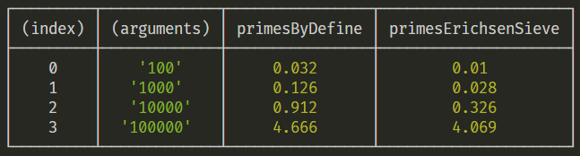

Measure your javascript function execution time. Both browser and node are supported.


## install 
```cli
npm install 'timit'
```

## example
```js
import timit from '.src/timit'

//timti(fn1[, fn2, ..., fnN][, argsList][, repeat][, numbers])

timit(function foo(){})

timit(function foo() {}, function bar() {}, 5, 10000)

timit(
    [
        function foo() {},
        function bar() {}, 
    ],
    ['args1', 'args2', 'args3']
)

const tim = new timit({
    funcs: [
        function foo() {},
        function bar() {}, 
    ],
    argsList: [
        ['1stArg: 1', '2ndArg: 100'],
        ['1stArg: 2', '2ndArg: 200']
    ],
    repeat: 3,
    numbers: 1,
    digits: 3
})

tim.time()

tim.time({repeat: 10})
```
The result is printed in the console. 


## options
| otpion | type | default | remark |
| -- | -- | -- | ---- |
| funcs | [Function] | - | function to test |
| argsList | Array | - | parameter sequence |
| repeat | Number | 5 | number of tests |
| numbers | Number | 1 | Code snippets that take very little time, run multiple times to zoom in  |
| digits | Number | 3 | display accuracy |
| output | Function | log | custom output |

> `digits` and `output` only support passing parameters through object.